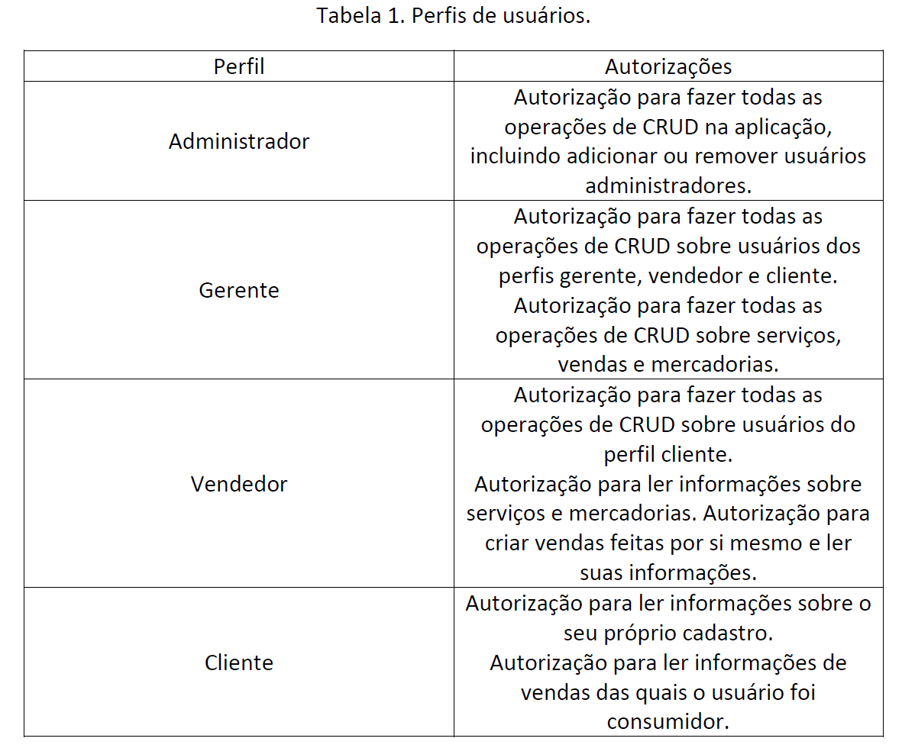

# ATVIV-DesenvolvimentoWEBIII
Atividade 4 
## Gabriel Brosig Briscese
## Thiago Zanin 

# ATV - IV
# Automanager - Microserviço de Cadastro de Clientes

O Automanager é um microserviço desenvolvido em Java com o framework Spring Boot para realizar o cadastro de dados de clientes, incluindo informações pessoais, documentos, endereço e telefones.

IMPLEMENTAÇÃO DE SEGURANÇA JWT




### Requisitos

- [Java 17](https://www.oracle.com/java/technologies/javase/jdk17-archive-downloads.html)
- [MySQL](https://www.mysql.com/)

### Configuração do Banco de Dados

1. Crie um banco de dados chamado `atividadeGerson`.
2. Atualize as configurações do banco de dados no arquivo `src/main/resources/application.properties`.

```properties
spring.datasource.url=jdbc:mysql://localhost:3306/atividadeGerson?createDatabaseIfNotExist=true
spring.datasource.username=root
spring.datasource.password=Topsp808!@
spring.datasource.driver-class-name=com.mysql.cj.jdbc.Driver

spring.jpa.hibernate.ddl-auto=update
spring.jpa.properties.hibernate.dialect=org.hibernate.dialect.MySQL8Dialect


